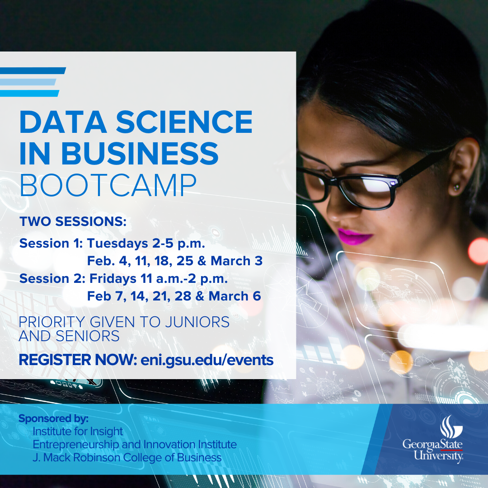

# Data-Science-in-Business-Bootcamp

A five session bootcamp introducing programming and machine learning tools.

Follow this guide to pepare your system for the bootcamp: [AnacondaInstructions_V2.docx](https://github.com/institute4insight/Data-Science-in-Business-Bootcamp/raw/master/1_Introduction/AnacondaInstructions_V2.docx?last_update=20200126)

 

